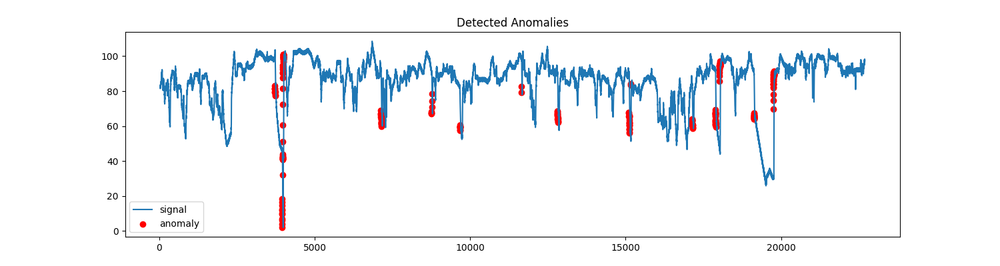
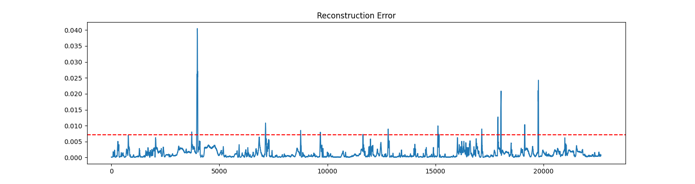

# Unsupervised LSTM Autoencoder for Time-Series Anomaly Detection

## 1. Introduction
Anomaly detection in time-series data is a fundamental problem in system monitoring, industrial IoT, and predictive maintenance. In many real-world scenarios, anomalous events are rare and labeled data is unavailable, making supervised learning approaches impractical.

This project implements an **unsupervised anomaly detection system** using an **LSTM-based autoencoder** trained exclusively on normal operational data. Anomalies are identified by analyzing **reconstruction error**, allowing the model to detect deviations from learned temporal patterns without requiring labeled anomalies.

---

## 2. Dataset Description
The dataset contains **machine temperature sensor readings** recorded over time.

**Key characteristics:**
- Univariate time-series data
- No anomaly labels used during training
- Abrupt temperature changes correspond to system failures

**Preprocessing steps:**
- Min–Max normalization
- Sliding window segmentation to capture temporal dependencies

---

## 3. Model Architecture
The model is based on an **LSTM encoder–decoder (autoencoder)** architecture:

- **Encoder:** Compresses input sequences into a latent representation
- **Decoder:** Reconstructs the original input sequence
- **Loss function:** Mean Squared Error (MSE)
- **Optimizer:** Adam

The model learns to reconstruct normal patterns accurately, while anomalous patterns produce higher reconstruction errors.

---

## 4. Anomaly Detection Methodology
Anomalies are detected using the distribution of reconstruction errors:

1. Compute reconstruction error for each time window
2. Estimate a statistical threshold:
threshold = mean(error) + k × std(error)

yaml
Copy code
3. Mark windows with reconstruction error above the threshold as anomalous

This method provides a simple yet effective way to control false positives in an unsupervised setting.

---

## 5. Results and Observations
The trained model successfully identifies anomalous segments corresponding to abnormal system behavior.

**Generated outputs include:**
- Raw time-series visualization
- Reconstruction error over time with threshold
- Detected anomalies overlaid on the original signal

These results demonstrate the suitability of LSTM autoencoders for unsupervised time-series anomaly detection.

---

## 6. Project Structure
```text
lstm-anomaly-detection/
├── data/
│   └── machine_temperature_system_failure.csv
├── models/
│   └── lstm_autoencoder.h5
├── results/
│   ├── plots/
│   │   ├── raw_signal.png
│   │   ├── reconstruction_error.png
│   │   └── detected_anomalies.png
│   └── summary.txt
├── src/
│   ├── config.py
│   ├── data_loader.py
│   ├── preprocess.py
│   ├── model.py
│   ├── train.py
│   └── detect.py
├── requirements.txt
└── README.md
```
## 7. How to Run
Install dependencies
pip install -r requirements.txt
Train the model
python src/train.py
Detect anomalies
python src/detect.py
All plots and summaries are automatically saved in the results/ directory.

## 8. Limitations
Static thresholding may not adapt to concept drift

Offline batch processing only

Limited to univariate time-series data

## 9. Future Improvements
Adaptive or percentile-based thresholding

Multivariate time-series support

Online anomaly detection

Evaluation on labeled benchmark datasets

## 10. Conclusion
This project demonstrates how unsupervised deep learning models can be applied to anomaly detection in time-series data where labeled anomalies are scarce. The modular design allows for easy extension and experimentation with more advanced techniques.

## Visual Results

### Detected Anomalies


### Reconstruction Error and Threshold

